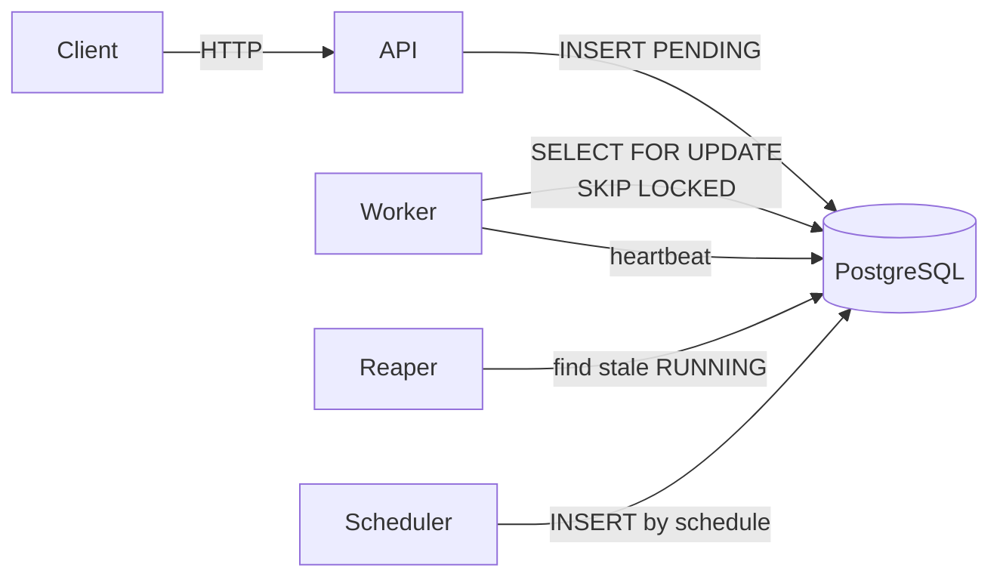
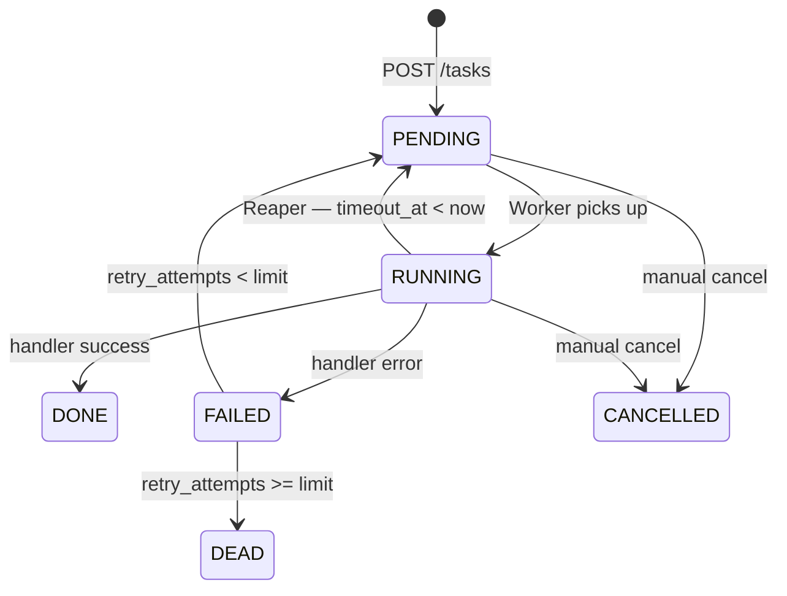

## Архитектура

```mermaid
flowchart LR
    Client -->|HTTP| API
    API -->|INSERT PENDING| DB[("PostgreSQL")]
    Worker -->|SELECT FOR UPDATE\nSKIP LOCKED| DB
    Worker -->|heartbeat| DB
    Reaper -->|find stale RUNNING| DB
    Scheduler -->|INSERT by schedule| DB
```

## Flow задачи

```mermaid
stateDiagram-v2
    [*] --> PENDING : POST /tasks
    PENDING --> RUNNING : Worker picks up
    RUNNING --> DONE : handler success
    RUNNING --> FAILED : handler error
    FAILED --> PENDING : retry_attempts < limit
    FAILED --> DEAD : retry_attempts >= limit
    RUNNING --> PENDING : Reaper — timeout_at < now
    PENDING --> CANCELLED : manual cancel
    RUNNING --> CANCELLED : manual cancel
```