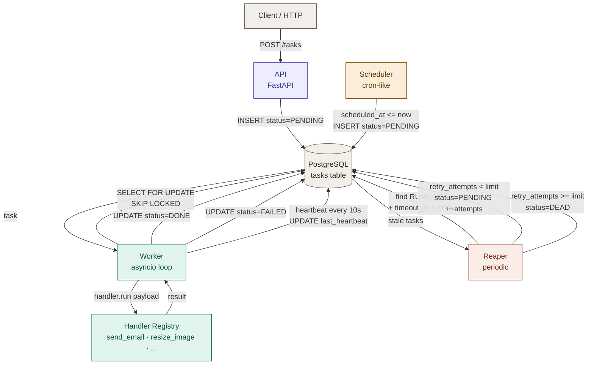

```mermaid
flowchart TD
    Client["Client / HTTP"] -->|POST /tasks| API["API\nFastAPI"]
    API -->|INSERT status=PENDING| DB[("PostgreSQL\ntasks table")]

    Worker["Worker\nasyncio loop"] -->|SELECT FOR UPDATE\nSKIP LOCKED| DB
    DB -->|task| Worker
    Worker -->|handler.run payload| Registry["Handler Registry\nsend_email · resize_image · ..."]
    Registry -->|result| Worker
    Worker -->|UPDATE status=DONE| DB
    Worker -->|UPDATE status=FAILED| DB

    Reaper["Reaper\nperiodic"] -->|find RUNNING\n+ timeout_at < now| DB
    DB -->|stale tasks| Reaper
    Reaper -->|retry_attempts < limit\nstatus=PENDING ++attempts| DB
    Reaper -->|retry_attempts >= limit\nstatus=DEAD| DB

    Scheduler["Scheduler\ncron-like"] -->|scheduled_at <= now\nINSERT status=PENDING| DB

    Worker -->|heartbeat every 10s\nUPDATE last_heartbeat| DB

    style API fill:#EEEDFE,stroke:#534AB7,color:#3C3489
    style Worker fill:#E1F5EE,stroke:#0F6E56,color:#085041
    style Reaper fill:#FAECE7,stroke:#993C1D,color:#712B13
    style Scheduler fill:#FAEEDA,stroke:#854F0B,color:#633806
    style DB fill:#F1EFE8,stroke:#5F5E5A,color:#2C2C2A
    style Registry fill:#E1F5EE,stroke:#0F6E56,color:#085041
    style Client fill:#F1EFE8,stroke:#5F5E5A,color:#2C2C2A
```