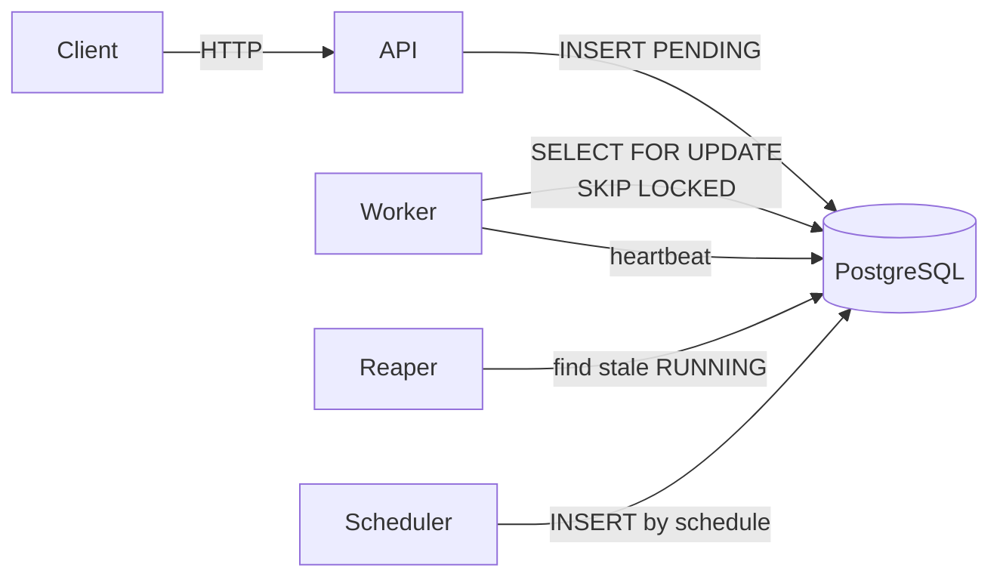
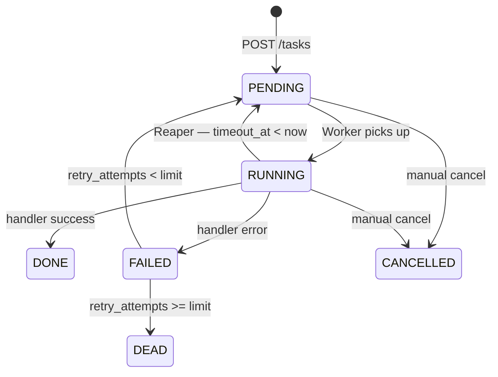

# TaskIQ

### Distributed Task & Job Processing Platform

A production-grade background job processing system built with Python and FastAPI. Designed to handle fault tolerance, automatic retries, scheduled execution, and real-time observability — without external message brokers.

---

## Architecture



**API** accepts tasks via REST and stores them in PostgreSQL with `PENDING` status.  
**Worker** polls the queue using `SELECT FOR UPDATE SKIP LOCKED` — guaranteeing atomic, race-free task pickup across multiple concurrent workers.  
**Reaper** runs periodically to detect stale `RUNNING` tasks (where `timeout_at < now()`) and returns them to the queue or marks them `DEAD` after exhausting retries.  
**Scheduler** promotes `SCHEDULED` tasks to `PENDING` when their `scheduled_at` time arrives.

---

## Task lifecycle



---

## Key features

- **At-least-once delivery** — tasks survive worker crashes and are automatically re-queued by the Reaper
- **Idempotency keys** — duplicate task submissions return the existing task, no double execution
- **Priority queues** — higher-priority tasks are picked up first
- **Exponential backoff** — failed tasks are retried up to a configurable limit before moving to dead-letter
- **Heartbeat tracking** — workers send periodic heartbeats; Reaper detects silence and reclaims tasks
- **Cron-like scheduling** — tasks can be created with a future `scheduled_at` timestamp
- **Prometheus metrics** — queue size, task duration, failure rate exposed at `/metrics`
- **Structured logging** — all task lifecycle events written to `logs/server.log`

---

## Getting started

**Requirements:** Docker and Docker Compose.

Clone the repository and create your `.env` file:

```bash
git clone https://github.com/Shjryoku/taskiq
cd taskiq
cp .env.example .env
```

Start all services:

```bash
docker-compose up --build
```

This starts PostgreSQL, Redis, and the application. Migrations run automatically on startup.

Open the API docs at `http://localhost:8000/docs`.

---

## Usage

Create a task:

```bash
curl -X POST http://localhost:8000/tasks/ \
  -H "Content-Type: application/json" \
  -d '{
    "name": "send_email",
    "priority": 1,
    "payload": {"email": "user@example.com"},
    "timeout_seconds": 300,
    "retry_limit": 3,
    "idempotency_key": "welcome-email-user-42"
  }'
```

Schedule a task for later:

```bash
curl -X POST http://localhost:8000/tasks/schedule \
  -H "Content-Type: application/json" \
  -d '{
    "name": "generate_report",
    "priority": 0,
    "payload": {"report_id": 99},
    "scheduled_at": "2026-06-01T09:00:00Z",
    "retry_limit": 3
  }'
```

View Prometheus metrics:

```bash
curl http://localhost:8000/metrics
```

---

## Running tests

```bash
pip install -r requirements.txt
pytest tests/ -v
```

---

## Tech stack

Python 3.12 · FastAPI · SQLAlchemy (async) · PostgreSQL · Redis · Alembic · Prometheus · Docker
